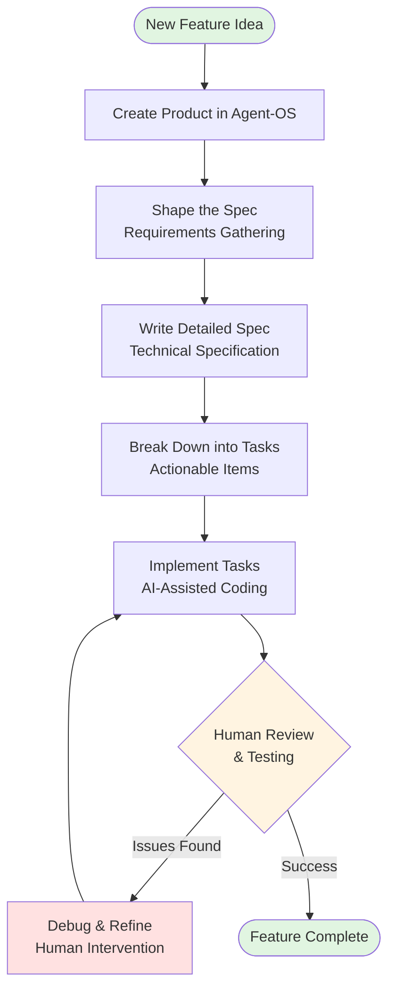
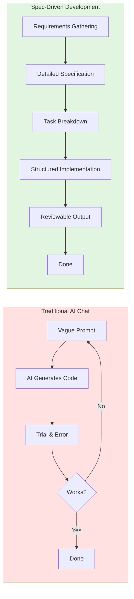
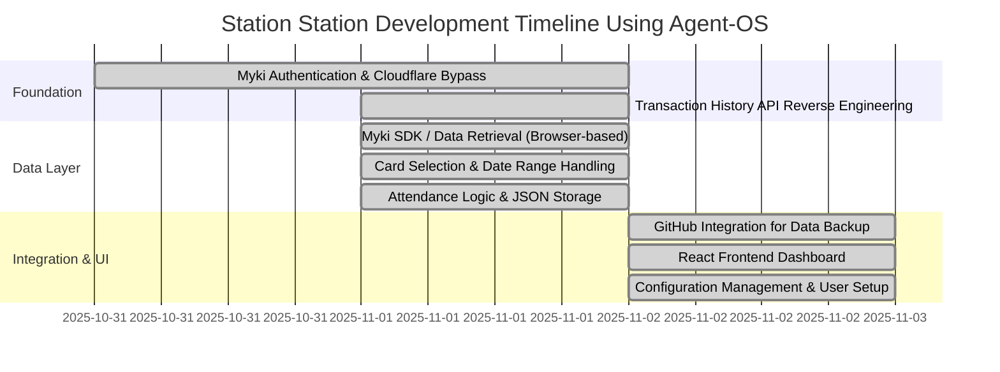
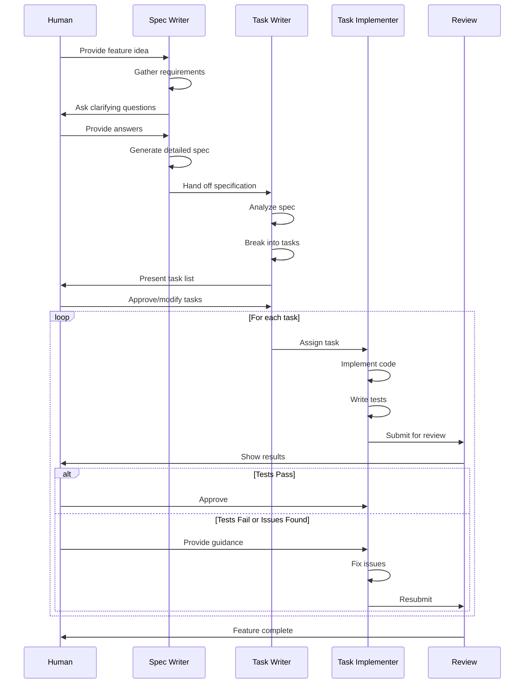

# Diagram Rendering Instructions for User

This document provides step-by-step instructions for rendering the Mermaid diagrams into images for the Medium blog series.

## Overview

Task Group 2 has prepared 4 Mermaid diagrams and 2 ASCII/text diagrams for your blog series. Since I cannot directly render Mermaid diagrams to images, you'll need to complete this manual step using the Mermaid Live Editor.

**Estimated time:** 15-20 minutes for all diagrams

---

## Step-by-Step Rendering Process

### Diagram 1: Agent-OS Workflow Diagram

**File to create:** `agent-os-workflow-diagram.png`

1. Open https://mermaid.live in your browser
2. Copy the following Mermaid code:



3. Paste into the Mermaid Live Editor (left panel)
4. Preview will appear in right panel
5. Click "Download" or "Export" button (usually PNG format)
6. Save as: `agent-os-workflow-diagram.png`
7. Move to: `/Users/gaikwadk/Documents/station-station-agentos/agent-os/specs/2025-11-03-technical-blog-sdd/planning/visuals/agent-os-workflow-diagram.png`

**Recommended export settings:**
- Format: PNG
- Width: 1200-1600px
- Quality: High
- Target file size: Under 500KB

---

### Diagram 2: SDD vs Traditional Comparison

**File to create:** `sdd-vs-traditional-comparison.png`

1. Open https://mermaid.live in your browser
2. Copy the following Mermaid code:



3. Paste into the Mermaid Live Editor
4. Preview will appear
5. Export as PNG
6. Save as: `sdd-vs-traditional-comparison.png`
7. Move to: `/Users/gaikwadk/Documents/station-station-agentos/agent-os/specs/2025-11-03-technical-blog-sdd/planning/visuals/sdd-vs-traditional-comparison.png`

---

### Diagram 3: Station Station Timeline (CUSTOMIZED WITH ACTUAL DATES)

**File to create:** `station-station-timeline.png`

1. Open https://mermaid.live in your browser
2. Copy the following Mermaid code (includes actual Oct 31 - Nov 2, 2025 development dates):



3. Paste into the Mermaid Live Editor
4. Preview will show timeline with actual dates
5. Export as PNG (landscape orientation works best for Gantt charts)
6. Save as: `station-station-timeline.png`
7. Move to: `/Users/gaikwadk/Documents/station-station-agentos/agent-os/specs/2025-11-03-technical-blog-sdd/planning/visuals/station-station-timeline.png`

---

### Diagram 4: Task Execution Flow Sequence Diagram

**File to create:** `agent-os-task-execution-flow.png`

1. Open https://mermaid.live in your browser
2. Copy the following Mermaid code:



3. Paste into the Mermaid Live Editor
4. Preview will show sequence diagram
5. Export as PNG (portrait orientation usually works best)
6. Save as: `agent-os-task-execution-flow.png`
7. Move to: `/Users/gaikwadk/Documents/station-station-agentos/agent-os/specs/2025-11-03-technical-blog-sdd/planning/visuals/agent-os-task-execution-flow.png`

---

## ASCII Diagrams (No Rendering Required)

These diagrams will be used directly in Medium code blocks—no image rendering needed.

### Diagram 5: Collaboration Spectrum (ASCII)
- **Location:** See `diagram-templates-final.md` section 4
- **Usage:** Copy directly into Medium code block (plain text)
- **Use in:** Part 4 (Real Challenges and AI Limitations)

### Diagram 6: OpenSpec Comparison Table (Markdown)
- **Location:** See `diagram-templates-final.md` section 6
- **Usage:** Paste directly into Medium text (Medium supports markdown tables)
- **Use in:** Part 1 or Part 5 (optional)

---

## Alternative: Use ASCII Versions

If you prefer not to render Mermaid images, ASCII alternatives are provided for:
- SDD vs Traditional comparison (see `diagram-templates-final.md` section 2)
- Station Station timeline (see `diagram-templates-final.md` section 3)

These can be used directly in Medium code blocks, though the Mermaid-rendered images will look more professional.

---

## File Organization After Rendering

Your `/visuals/` folder should contain these 4 PNG files:

```
/Users/gaikwadk/Documents/station-station-agentos/agent-os/specs/2025-11-03-technical-blog-sdd/planning/visuals/
├── agent-os-workflow-diagram.png
├── sdd-vs-traditional-comparison.png
├── station-station-timeline.png
└── agent-os-task-execution-flow.png
```

---

## File Size Optimization

After rendering, check file sizes:

```bash
cd /Users/gaikwadk/Documents/station-station-agentos/agent-os/specs/2025-11-03-technical-blog-sdd/planning/visuals/
ls -lh *.png
```

**Target:** Each PNG should be under 500KB (under 1MB max)

If files are too large, you can optimize with:
```bash
# On macOS, use sips to resize if needed
sips -Z 1600 agent-os-workflow-diagram.png
```

Or use online tools like TinyPNG or Squoosh.app for compression.

---

## Verification Checklist

After rendering all diagrams, verify:

- [ ] `agent-os-workflow-diagram.png` - Shows iterative cycle with feedback loop
- [ ] `sdd-vs-traditional-comparison.png` - Shows side-by-side comparison
- [ ] `station-station-timeline.png` - Shows Oct 31 - Nov 2, 2025 dates, all 8 features, 3 phases
- [ ] `agent-os-task-execution-flow.png` - Shows sequence with human review checkpoints
- [ ] All files are under 1MB (preferably under 500KB each)
- [ ] All files saved in `/visuals/` folder
- [ ] Files are PNG format (Medium compatible)

---

## Next Steps

Once diagrams are rendered:

1. Review the diagrams visually to ensure they're clear and readable
2. Check that the Station Station timeline shows the correct dates
3. Proceed to Task Groups 3-7 (blog content creation)
4. Use the diagram files when embedding in Medium articles

---

## Troubleshooting

**Problem:** Mermaid Live Editor not rendering correctly
- Try refreshing the page
- Clear browser cache
- Try different browser (Chrome, Firefox, Safari all work)

**Problem:** Exported PNG is too large
- Reduce export width to 1200px
- Use PNG compression tool
- Consider SVG export instead (Medium supports SVG)

**Problem:** Gantt chart dates not showing
- Verify dateFormat is YYYY-MM-DD
- Check dates are valid (Oct 31 - Nov 2, 2025)
- Ensure :done tags are present

**Problem:** Sequence diagram too tall
- This is normal for sequence diagrams
- Export as-is (portrait orientation)
- Medium will handle scaling

---

**Need Help?**

All diagram source code is in `/Users/gaikwadk/Documents/station-station-agentos/agent-os/specs/2025-11-03-technical-blog-sdd/planning/diagram-templates-final.md`

Alt text and descriptions for each diagram are also included in that file for when you embed the images in Medium.

---

**Document Status:** Ready for user action
**Estimated completion time:** 15-20 minutes
**Required tool:** Web browser with access to https://mermaid.live
