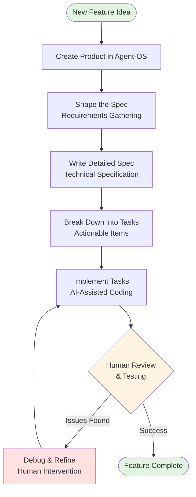
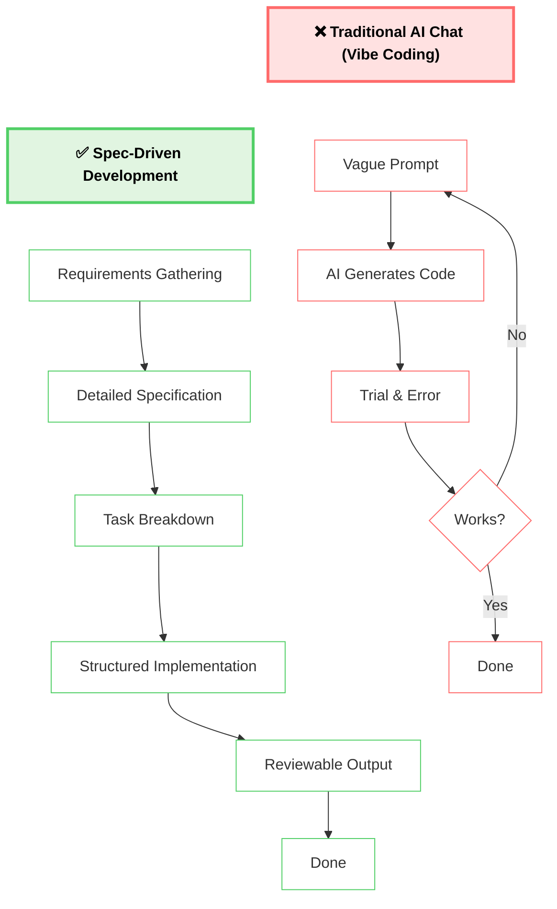
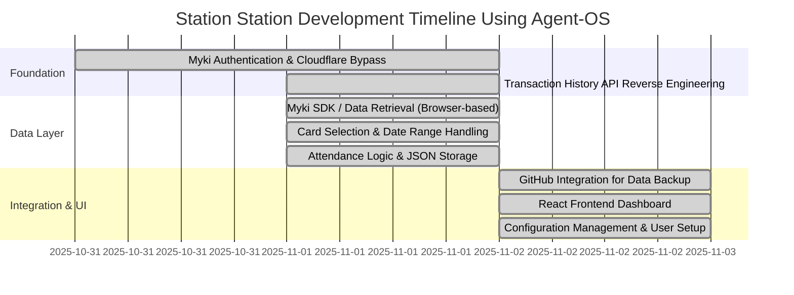
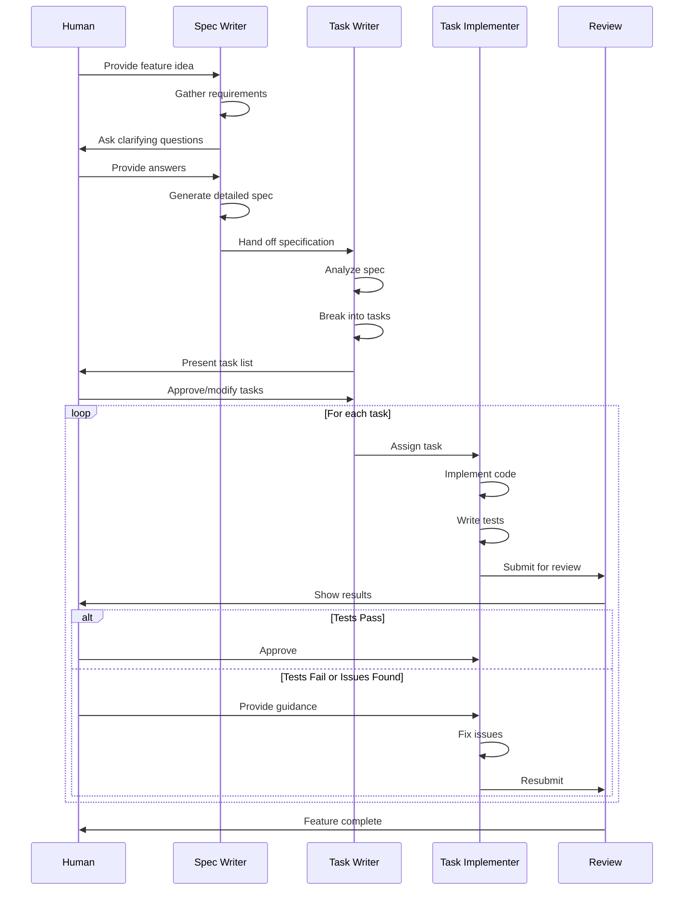

# Final Diagram Templates for Blog Series

This document contains finalized, production-ready diagrams customized with actual Station Station development data. All diagrams are ready for Medium publication.

## Diagram Rendering Instructions

### For Mermaid Diagrams:
1. Visit https://mermaid.live
2. Copy the Mermaid code from this document
3. Paste into the Mermaid Live Editor
4. Export as PNG or SVG (PNG recommended for Medium compatibility)
5. Save to `/Users/gaikwadk/Documents/station-station-agentos/agent-os/specs/2025-11-03-technical-blog-sdd/planning/visuals/`
6. Use the provided filename for consistency

### For ASCII Diagrams:
1. Copy the ASCII diagram exactly as shown
2. Paste into Medium code block
3. No language identifier needed (use plain text code block)

---

## 1. Agent-OS Workflow Diagram (Mermaid)

**Filename:** `agent-os-workflow-diagram.png`

**Mermaid Code:**


**Alt Text:**
"Agent-OS workflow diagram showing iterative cycle: Create Product, Shape Spec, Write Spec, Write Tasks, Implement Tasks, Human Review with feedback loop for debugging and refinement until feature is complete."

**Description for Blog (introduce diagram with this text):**
"The agent-os workflow follows a structured, iterative cycle. Notice the feedback loop where human review catches issues that require debugging before the feature is complete. This isn't full automation—it's a partnership where AI handles implementation and humans guide the architecture and review the results."

**Use in:** Part 3 (Agent-OS Workflow in Action)

---

## 2. SDD vs Traditional AI Chat Comparison (Mermaid)

**Filename:** `sdd-vs-traditional-comparison.png`

**Mermaid Code:**


**Alt Text:**
"Side-by-side comparison: Traditional AI Chat shows trial-and-error loop with vague prompts leading to repeated attempts until code works. Spec-Driven Development shows linear progression from requirements to specification to implementation to reviewable output."

**Description for Blog:**
"The contrast is striking. Traditional AI chat often becomes a trial-and-error loop—you provide a vague prompt, get generated code, test it, realize it doesn't quite work, and start over. Spec-Driven Development follows a predictable path: gather requirements, write detailed specifications, break into tasks, implement systematically, and produce reviewable output. You spend more time upfront on specs, but save time on debugging and rework."

**ASCII Alternative (for code block):**
```
TRADITIONAL AI CHAT                    SPEC-DRIVEN DEVELOPMENT
═══════════════════                    ═══════════════════════

Vague Prompt                           Requirements Gathering
      ↓                                          ↓
AI Generates Code                      Detailed Specification
      ↓                                          ↓
Trial & Error  ←──┐                    Task Breakdown
      ↓            │                             ↓
   Works?          │                    Structured Implementation
      ├─── No ─────┘                             ↓
      ↓ Yes                             Reviewable Output
   Done                                          ↓
                                               Done

❌ Unpredictable                       ✅ Predictable
❌ Hard to review                      ✅ Easy to review
❌ Difficult to iterate                ✅ Iterative by design
```

**Use in:** Part 1 (Introduction to Spec-Driven Development)

---

## 3. Station Station Feature Implementation Timeline (Mermaid - Customized with Actual Dates)

**Filename:** `station-station-timeline.png`

**Mermaid Code (Updated with Actual Development Dates):**


**Alt Text:**
"Gantt chart showing Station Station development timeline from October 31 to November 2, 2025. Phase 1 Foundation includes authentication and API reverse engineering. Phase 2 Data Layer covers SDK, card selection, and attendance logic. Phase 3 Integration and UI includes GitHub integration, frontend dashboard, and configuration management."

**Description for Blog:**
"Station Station was built incrementally over just 2-3 days using the agent-os SDD approach. The timeline shows three phases: Foundation (authentication and API discovery), Data Layer (data extraction and processing), and Integration & UI (GitHub backup and React dashboard). Each feature built on the previous one, with human review at each phase transition. The Cloudflare bypass was the critical blocker—once that was solved, the rest of the features followed in rapid succession."

**ASCII Alternative (Simplified):**
```
STATION STATION DEVELOPMENT TIMELINE
═══════════════════════════════════
Timeline: Oct 31 - Nov 2, 2025 (~2-3 days active development)

PHASE 1: FOUNDATION (Oct 31 - Nov 1)
├─ ✅ Myki Authentication & Cloudflare Bypass (Large, 2 days)
└─ ✅ Transaction History API Reverse Engineering (Medium, 1 day)

PHASE 2: DATA LAYER (Nov 1)
├─ ✅ Myki SDK / Data Retrieval - Browser-based (Medium, 1 day)
├─ ✅ Card Selection & Date Range Handling (Small, < 1 day)
└─ ✅ Attendance Logic & JSON Storage (Medium, 1 day)

PHASE 3: INTEGRATION & UI (Nov 2)
├─ ✅ GitHub Integration for Data Backup (Small, < 1 day)
├─ ✅ React Frontend Dashboard (Medium, 1 day)
└─ ✅ Configuration Management & User Setup (Small, < 1 day)

Result: 8 features completed, ~6,300 LOC, live at https://koustubh25.github.io/station-station/
```

**Use in:** Part 2 (The Station Station Project)

---

## 4. When AI Needs Human Help - Collaboration Spectrum (ASCII)

**Filename:** N/A (use in code block directly)

**ASCII Diagram:**
```
THE AI-HUMAN COLLABORATION SPECTRUM
═══════════════════════════════════

┌─────────────────────────────────────────────────────────────┐
│                    AI Can Handle Alone                      │
├─────────────────────────────────────────────────────────────┤
│  • Boilerplate code generation                              │
│  • Standard CRUD operations                                 │
│  • Test case creation for well-defined logic                │
│  • Simple UI component implementation                       │
│  • CSS styling based on design specifications               │
│  • Documentation generation from code                       │
└─────────────────────────────────────────────────────────────┘

┌─────────────────────────────────────────────────────────────┐
│                AI + Human Review Required                   │
├─────────────────────────────────────────────────────────────┤
│  • Complex business logic requiring domain knowledge        │
│  • Integration with external APIs                           │
│  • Cross-file refactoring                                   │
│  • Performance optimization decisions                       │
│  • UX decisions needing user feedback                       │
│  • Configuration changes affecting multiple systems         │
└─────────────────────────────────────────────────────────────┘

┌─────────────────────────────────────────────────────────────┐
│              Human Must Lead (AI as Assistant)              │
├─────────────────────────────────────────────────────────────┤
│  • Debugging multi-layered issues ⚠️                        │
│  • Architectural decisions with domain context              │
│  • Security implementations (authentication, authorization) │
│  • Domain-specific logic requiring specialized knowledge    │
│  • Trade-off decisions balancing competing concerns         │
│  • Identifying root causes in complex systems               │
└─────────────────────────────────────────────────────────────┘

⚠️ Real Example: manualAttendanceDates Field Bug
   Problem: Date handling logic for manual attendance override wasn't working
   AI Attempts: Failed to fix after several debugging rounds
   Human Intervention: Reviewed code, identified specific problem location
   Resolution: Human guidance → AI implemented fix successfully

   Lesson: Complex debugging across multiple layers requires human code
   comprehension and architectural understanding. AI can implement fixes
   once the problem is identified, but identifying the root cause often
   needs human intuition and domain knowledge.
```

**Alt Text:**
"Three-tier collaboration spectrum diagram showing: Tier 1 - AI Can Handle Alone (boilerplate, CRUD, tests, simple components); Tier 2 - AI + Human Review Required (complex logic, APIs, refactoring, performance); Tier 3 - Human Must Lead (debugging, architecture, security, domain expertise). Includes real example of manualAttendanceDates bug where AI failed but human identified the problem location."

**Description for Blog:**
"Not all coding tasks are equal when it comes to AI assistance. This spectrum shows when to trust AI alone, when to review its work carefully, and when you need to take the lead. The manualAttendanceDates debugging story exemplifies Tier 3: the AI tried multiple approaches but couldn't identify where the problem resided. I had to review the code myself, trace through the logic, and pinpoint the specific function that needed fixing. Once I identified the location, the AI successfully implemented the fix."

**Use in:** Part 4 (Real Challenges and AI Limitations)

---

## 5. Agent-OS Task Execution Flow - Sequence Diagram (Mermaid)

**Filename:** `agent-os-task-execution-flow.png`

**Mermaid Code:**


**Alt Text:**
"Sequence diagram showing Agent-OS task execution flow: Human provides feature idea to Spec Writer, who gathers requirements and generates detailed spec. Task Writer breaks spec into tasks for Human approval. Task Implementer executes each task, writes tests, and submits for Review. Human reviews results and either approves or provides guidance for fixes. Process loops until feature is complete."

**Description for Blog:**
"This sequence diagram reveals the continuous human-AI collaboration throughout development. Notice how human review happens at key decision points—not just at the end. After spec writing, the human approves the requirements. After task breakdown, the human verifies the implementation plan. After each task implementation, the human reviews the code and tests. This structured review process is what makes SDD predictable and safe."

**Use in:** Part 3 (Agent-OS Workflow in Action)

---

## 6. OpenSpec vs Agent-OS Comparison Table (Markdown)

**Filename:** N/A (use directly in blog text)

**Markdown Table:**

| Aspect | OpenSpec | Agent-OS |
|--------|----------|----------|
| **Primary Focus** | Change proposals for existing systems | Full product lifecycle from idea to deployment |
| **Workflow Phases** | Proposal → Review → Implement → Archive | Product → Spec → Tasks → Implementation |
| **AI Tool Support** | Multiple AI tools via AGENTS.md convention | Optimized for Claude with deep integration |
| **Best For** | Teams using various AI tools, incremental changes to existing codebases | Solo developers or small teams building new products from scratch |
| **Spec Format** | Scenario-based specifications with change deltas (ADDED/MODIFIED/REMOVED) | Requirements-based with Goal, User Stories, Technical Implementation Details |
| **Orchestration** | N/A (single tool workflow) | Multi-agent orchestration for complex coordination |
| **Setup Complexity** | Minimal (two folders: specs/ and changes/) | Moderate (product structure, multiple agents, orchestration) |

**Alt Text:**
"Comparison table of OpenSpec vs Agent-OS showing differences in focus, workflow, AI tool support, best use cases, spec format, orchestration capabilities, and setup complexity. Both are valid spec-driven development approaches for different use cases."

**Description for Blog:**
"Both OpenSpec and agent-os are valid SDD approaches solving different problems. OpenSpec excels at managing structured changes to existing codebases with multi-tool team compatibility. Agent-os is optimized for building complete products from scratch with deep Claude integration and sophisticated orchestration. Neither is better—they're designed for different use cases. For Station Station, a greenfield project built solo with Claude, agent-os was the natural fit."

**Use in:** Part 1 (Introduction, brief mention) OR Part 5 (Conclusion, optional if space allows)

---

## Diagram-to-Blog-Part Mapping

### Part 1: Introduction to Spec-Driven Development
- **Diagram:** SDD vs Traditional AI Chat Comparison (Mermaid or ASCII alternative)
- **Purpose:** Illustrate core SDD benefits vs ad-hoc AI chat trial-and-error
- **Optional:** OpenSpec vs Agent-OS comparison table (brief, 1-2 paragraphs context)

### Part 2: The Station Station Project
- **Diagram:** Station Station Feature Implementation Timeline (Mermaid or ASCII alternative)
- **Purpose:** Show incremental development across 3 phases, prove SDD effectiveness with real timeline
- **Context:** 8 features completed in 2-3 days using structured approach

### Part 3: Agent-OS Workflow in Action
- **Diagram 1:** Agent-OS Workflow Diagram (Mermaid)
- **Purpose:** Show iterative cycle with feedback loop for debugging
- **Diagram 2:** Agent-OS Task Execution Flow sequence diagram (Mermaid)
- **Purpose:** Illustrate human review checkpoints throughout process, not just at end
- **Context:** Walk through each workflow phase with Station Station examples

### Part 4: Real Challenges and AI Limitations
- **Diagram:** When AI Needs Human Help - Collaboration Spectrum (ASCII)
- **Purpose:** Set realistic expectations about AI capabilities and limitations
- **Context:** manualAttendanceDates debugging story as Tier 3 example, additional challenges across all tiers

### Part 5: Conclusion and Resources
- **Diagram (Optional):** OpenSpec vs Agent-OS comparison table (Markdown)
- **Purpose:** Provide decision framework context, show different valid approaches
- **Context:** Only include if word count allows and flow supports it

**Diagram Distribution Balance:**
- Part 1: 1 diagram (comparison)
- Part 2: 1 diagram (timeline)
- Part 3: 2 diagrams (workflow + sequence)
- Part 4: 1 diagram (collaboration spectrum)
- Part 5: 0-1 diagram (optional table)
- **Total:** 5-6 diagrams across 5 parts (balanced, not overwhelming)

---

## Accessibility Guidelines

**For all diagrams, ensure:**

1. **Alt Text Requirements:**
   - Describe visual flow and key elements
   - Include main concepts and relationships
   - Mention colors or visual distinctions if meaningful
   - Keep concise but complete (1-2 sentences)

2. **Text Descriptions:**
   - Always introduce diagram with explanatory text BEFORE embedding
   - Explain what reader should focus on or notice
   - Provide context for how diagram relates to surrounding text
   - Ensure diagram is understandable without visual rendering (screen reader compatible)

3. **Color Usage:**
   - Color is not the only means of conveying information
   - Green/red color coding supplemented with labels (Success/Issues)
   - Diagrams remain understandable in grayscale

4. **ASCII Diagrams:**
   - Test in monospace font
   - Verify rendering in code blocks
   - Ensure box-drawing characters display correctly
   - Provide meaningful structure even without visual formatting

---

## File Size and Format Optimization

**For Mermaid-rendered images:**
- Export as PNG (preferred) or SVG
- Target resolution: 1200-1600px width for Medium
- Optimize file size: under 500KB per image (under 1MB max)
- Use descriptive filenames: `agent-os-workflow-diagram.png`
- Save to: `/Users/gaikwadk/Documents/station-station-agentos/agent-os/specs/2025-11-03-technical-blog-sdd/planning/visuals/`

**For ASCII diagrams:**
- No image file needed
- Paste directly into Medium code block
- Use plain text code block (no language identifier)
- Test formatting before publishing

**For Markdown tables:**
- Use directly in Medium text
- Medium supports standard markdown table syntax
- No separate image needed

---

## Medium Embedding Instructions

**Mermaid Images:**
1. Upload PNG/SVG to Medium article
2. Add alt text from this document
3. Add caption with diagram title
4. Introduce with description text before image

**ASCII Diagrams:**
1. Insert code block in Medium editor
2. Select "Plain Text" or no language
3. Copy ASCII diagram exactly (preserve spacing)
4. Add introductory text before code block

**Markdown Tables:**
1. Insert directly into Medium text
2. Medium will auto-format as table
3. Add introductory text before table

---

## Quality Checklist

Before using diagrams in blog:

- [ ] All Mermaid diagrams tested in Mermaid Live Editor
- [ ] All ASCII diagrams tested in monospace code blocks
- [ ] All alt text written and descriptive
- [ ] All text descriptions provide context
- [ ] Station Station timeline uses actual development dates (Oct 31 - Nov 2, 2025)
- [ ] All 8 features represented correctly in timeline
- [ ] Phase groupings match product documentation
- [ ] Diagram-to-blog-part mapping documented
- [ ] Distribution balanced (not too many diagrams in one part)
- [ ] All diagrams validated for Medium compatibility
- [ ] File naming convention followed
- [ ] Accessibility guidelines met

---

**Document Version:** 2.0 - Final (Customized with Actual Data)
**Created:** November 3, 2025
**Purpose:** Production-ready diagrams for Medium blog series
**Status:** Ready for rendering and publication
