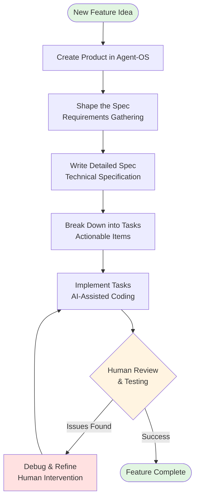
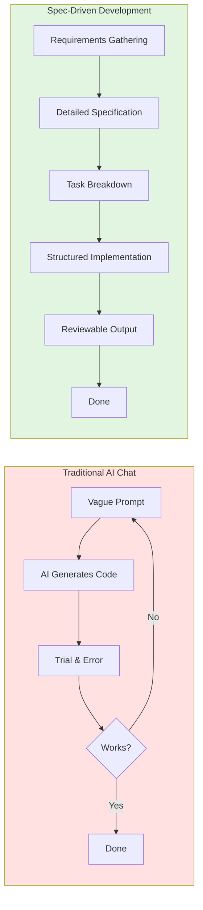
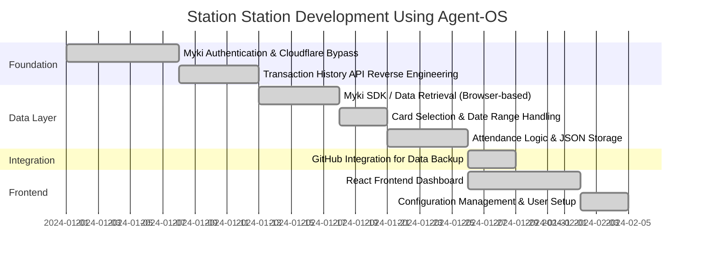
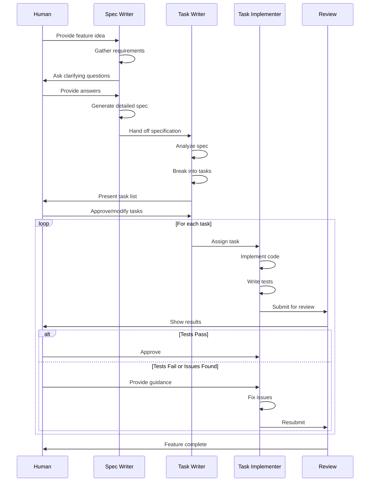

# Textual Diagram Templates for Blog Series

This document contains textual diagram templates (Mermaid and ASCII) that can be used directly in the blog posts or converted to visual assets.

## 1. Agent-OS Workflow Diagram (Mermaid)



**Description for blog:** This diagram shows the iterative workflow of building features using agent-os. Notice the feedback loop where human review catches issues that require debugging before the feature is complete.

---

## 2. SDD vs Traditional AI Chat Comparison (Mermaid)



**Alternative ASCII Version:**

```
TRADITIONAL AI CHAT                    SPEC-DRIVEN DEVELOPMENT
═══════════════════                    ═══════════════════════

Vague Prompt                           Requirements Gathering
      ↓                                          ↓
AI Generates Code                      Detailed Specification
      ↓                                          ↓
Trial & Error  ←──┐                    Task Breakdown
      ↓            │                             ↓
   Works?          │                    Structured Implementation
      ├─── No ─────┘                             ↓
      ↓ Yes                             Reviewable Output
   Done                                          ↓
                                               Done

❌ Unpredictable                       ✅ Predictable
❌ Hard to review                      ✅ Easy to review
❌ Difficult to iterate                ✅ Iterative by design
```

---

## 3. OpenSpec vs Agent-OS Comparison Table

```
╔════════════════════╦═══════════════════════════╦═══════════════════════════╗
║    Aspect          ║       OpenSpec            ║       Agent-OS            ║
╠════════════════════╬═══════════════════════════╬═══════════════════════════╣
║ Primary Focus      ║ Change proposals for      ║ Full product lifecycle    ║
║                    ║ existing systems          ║ from idea to deployment   ║
╠════════════════════╬═══════════════════════════╬═══════════════════════════╣
║ Workflow Phases    ║ Proposal → Review →       ║ Product → Spec → Tasks →  ║
║                    ║ Implement → Archive       ║ Implementation            ║
╠════════════════════╬═══════════════════════════╬═══════════════════════════╣
║ AI Tool Support    ║ Multiple AI tools via     ║ Optimized for Claude      ║
║                    ║ AGENTS.md convention      ║ with orchestration        ║
╠════════════════════╬═══════════════════════════╬═══════════════════════════╣
║ Best For           ║ Teams using various AI    ║ Solo developers or small  ║
║                    ║ tools, incremental changes║ teams building new products║
╠════════════════════╬═══════════════════════════╬═══════════════════════════╣
║ Spec Format        ║ Scenario-based            ║ Requirements + Technical  ║
║                    ║ specifications            ║ implementation details    ║
╚════════════════════╩═══════════════════════════╩═══════════════════════════╝
```

**Markdown Table Version (for Medium):**

| Aspect | OpenSpec | Agent-OS |
|--------|----------|----------|
| **Primary Focus** | Change proposals for existing systems | Full product lifecycle from idea to deployment |
| **Workflow Phases** | Proposal → Review → Implement → Archive | Product → Spec → Tasks → Implementation |
| **AI Tool Support** | Multiple AI tools via AGENTS.md | Optimized for Claude with orchestration |
| **Best For** | Teams using various AI tools, incremental changes | Solo developers or small teams building new products |
| **Spec Format** | Scenario-based specifications | Requirements + Technical implementation details |

---

## 4. Station Station Feature Implementation Timeline (Mermaid)



**Alternative Simple ASCII Timeline:**

```
STATION STATION DEVELOPMENT TIMELINE
═══════════════════════════════════

PHASE 1: FOUNDATION (Week 1-2)
├─ ✅ Myki Authentication & Cloudflare Bypass (Large task)
└─ ✅ Transaction History API Reverse Engineering (Medium task)

PHASE 2: DATA LAYER (Week 2-3)
├─ ✅ Myki SDK / Data Retrieval - Browser-based (Medium task)
├─ ✅ Card Selection & Date Range Handling (Small task)
└─ ✅ Attendance Logic & JSON Storage (Medium task)

PHASE 3: INTEGRATION & UI (Week 3-4)
├─ ✅ GitHub Integration for Data Backup (Small task)
├─ ✅ React Frontend Dashboard (Medium task)
└─ ✅ Configuration Management & User Setup (Small task)

Result: Live app at https://koustubh25.github.io/station-station/
```

---

## 5. When AI Needs Human Help (Conceptual Diagram)

```
THE AI-HUMAN COLLABORATION SPECTRUM
═══════════════════════════════════

┌─────────────────────────────────────────────────────────────┐
│                    AI Can Handle Alone                      │
├─────────────────────────────────────────────────────────────┤
│  • Boilerplate code generation                              │
│  • Standard CRUD operations                                 │
│  • Test case creation for well-defined logic                │
│  • Simple UI component implementation                       │
└─────────────────────────────────────────────────────────────┘

┌─────────────────────────────────────────────────────────────┐
│                AI + Human Review Required                   │
├─────────────────────────────────────────────────────────────┤
│  • Complex business logic                                   │
│  • Integration with external APIs                           │
│  • Cross-file refactoring                                   │
│  • Performance optimization                                 │
└─────────────────────────────────────────────────────────────┘

┌─────────────────────────────────────────────────────────────┐
│              Human Must Lead (AI as Assistant)              │
├─────────────────────────────────────────────────────────────┤
│  • Debugging multi-layered issues ⚠️                        │
│  • Architectural decisions                                  │
│  • Security implementations                                 │
│  • Domain-specific logic requiring context                  │
└─────────────────────────────────────────────────────────────┘

⚠️ Real Example: manualAttendanceDates field
   AI couldn't fix the bug after several rounds.
   Human review identified the issue location.
   AI then implemented the fix successfully.
```

---

## 6. Agent-OS Task Execution Flow (Detailed)



**Description for blog:** This sequence diagram shows how different agent-os components collaborate with the human developer throughout the development lifecycle. Notice how human review happens at key decision points, not just at the end.

---

## Usage Instructions

**For Medium Blog Posts:**
1. Mermaid diagrams may need to be rendered to images using tools like:
   - Mermaid Live Editor (https://mermaid.live)
   - VS Code Mermaid extension
   - Online Mermaid renderers

2. ASCII diagrams can be used directly in code blocks:
   ```
   [ASCII diagram here]
   ```

3. Tables should use Medium's markdown table support

4. Always provide text descriptions for accessibility

**Diagram Selection Guide:**
- **Part 1 (Introduction):** Use SDD vs Traditional AI Chat comparison
- **Part 2 (The Project):** Use Station Station Feature Implementation Timeline
- **Part 3 (Agent-OS Workflow):** Use Agent-OS Workflow Diagram + Task Execution Flow
- **Part 4 (Lessons Learned):** Use "When AI Needs Human Help" diagram
- **Part 5 (Conclusion):** Optional: OpenSpec vs Agent-OS comparison table

**Customization Notes:**
- Dates in Gantt chart are placeholders - adjust to actual development timeline
- Color coding in Mermaid diagrams can be modified for brand consistency
- ASCII diagrams can be simplified further if needed for Medium's formatting
